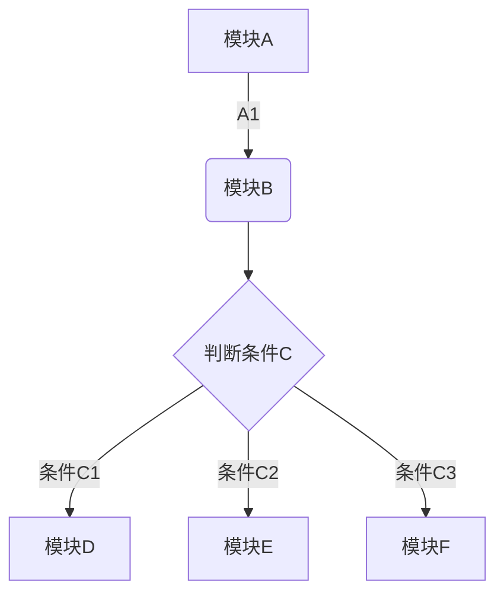
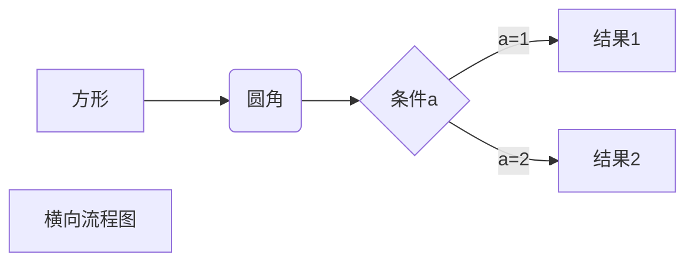
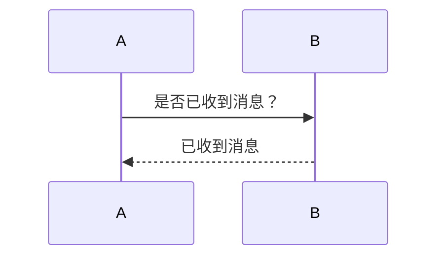
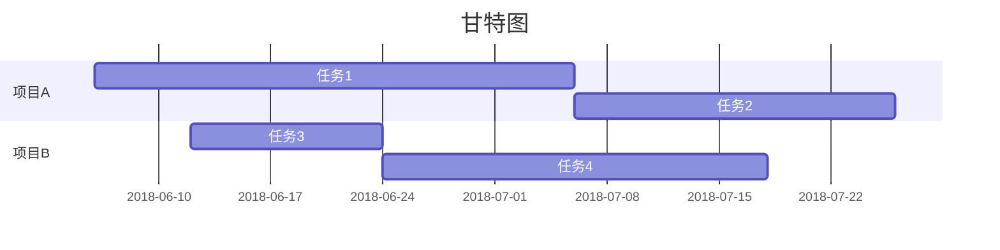

# 标题1
## 标题2
### 标题3
#### 标题4
##### 标题4
***
**粗体**
*斜体*
<u>下划线</u>
~~删除线~~

* * *

\*\* 正常显示星号 \*\*
***


* 列表1
456
* 列表2
123123
* 列表3

* * *

1. 有序列表1
xxxxxxxx
2. 有序列表2
xxxxxxxx
3. 有序列表3
xxxxxxxx

* * *


1. 序列嵌套1
    * 第一项嵌套的第1个元素
    * 第一项嵌套的第2个元素
2. 序列嵌套2
    * 第1项嵌套的第1个元素
    * 第2项嵌套的第2个元素

* * *

> 区块嵌套
> > 区块嵌套
> > > 区块嵌套
> > > > 区块嵌套


* * *

> 区块嵌套
> 1. 有序列表1
> xxxxxxxx
> 2. 有序列表2
> xxxxxxxx
> 3. 有序列表3
> xxxxxxxx
> > 区块嵌套
> > 1. 有序列表1
> > xxxxxxxx
> > 2. 有序列表2
> > xxxxxxxx
> > 3. 有序列表3
> > xxxxxxxx

* * *

`print("123")`  

* * *

```python
a=2
if a==1:
    print("123")
```

* * *
[百度](www.baidu.com)

* * *

<www.baidu.com>

* * *

链接也可以用变量来代替，文档末尾附带变量地址：
这个链接用 1 作为网址变量 [百度][1]
这个链接用 runoob 作为网址变量 [谷歌][google]
然后在文档的结尾为变量赋值（网址）

  [1]: www.baidu.com
  [google]: www.google.com
 
 * * *


* * *

|表头1|表头2|表头3|
|---|---|---|

* * *

|表头1|表头2|表头3|
|---|---|---|
|单元格1|单元格2|单元格3|

* * *
|左对齐|右对齐|居中|
|:---|---:|:---:|
|单元格1|单元格2|单元格3|

* * *

使用 <kbd>Ctrl</kbd>+<kbd>Alt</kbd>+<kbd>Del</kbd> 重启电脑

* * *

* * *


* * *


* * *



